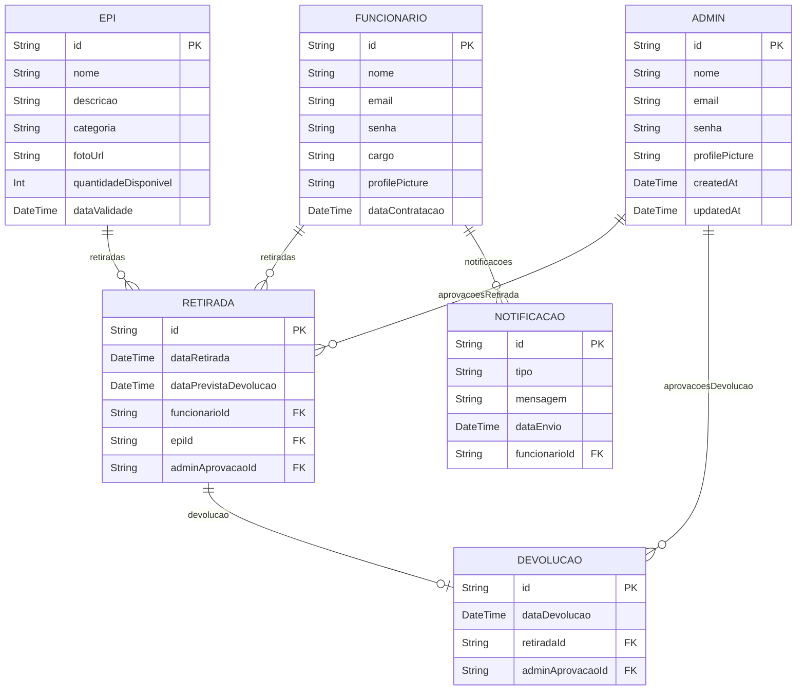

## Projeto PI

[Slide Presentation](https://www.canva.com/design/DAGIC_-R_X0/9Y1IY3wnL_3RCfglyLM-8Q/edit?utm_content=DAGIC_-R_X0&utm_campaign=designshare&utm_medium=link2&utm_source=sharebutton)

## UML Diagram

