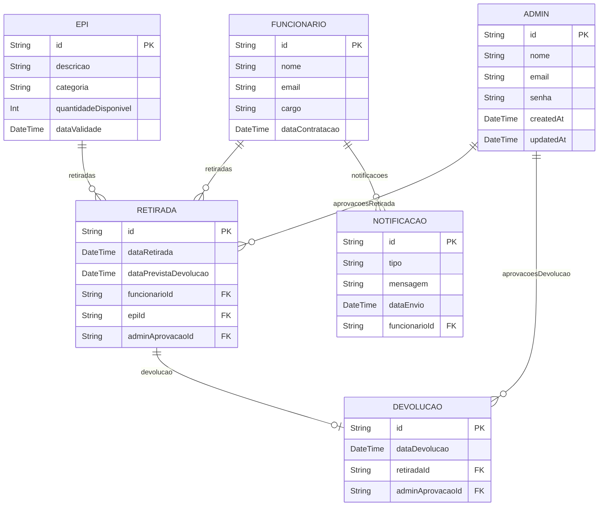

## Projeto PI

## UML Diagram

```mermaid
erDiagram
    FUNCIONARIO {
        String id PK
        String nome
        String email
        String cargo
        DateTime dataContratacao
    }

    EPI {
        String id PK
        String descricao
        String categoria
        Int quantidadeDisponivel
        DateTime dataValidade
    }

    RETIRADA {
        String id PK
        DateTime dataRetirada
        DateTime dataPrevistaDevolucao
        String funcionarioId FK
        String epiId FK
        String adminAprovacaoId FK
    }

    DEVOLUCAO {
        String id PK
        DateTime dataDevolucao
        String retiradaId FK
        String adminAprovacaoId FK
    }

    NOTIFICACAO {
        String id PK
        String tipo
        String mensagem
        DateTime dataEnvio
        String funcionarioId FK
    }

    ADMIN {
        String id PK
        String nome
        String email
        String senha
        DateTime createdAt
        DateTime updatedAt
    }

    FUNCIONARIO ||--o{ RETIRADA : retiradas
    EPI ||--o{ RETIRADA : retiradas
    RETIRADA ||--o| DEVOLUCAO : devolucao
    FUNCIONARIO ||--o{ NOTIFICACAO : notificacoes
    ADMIN ||--o{ RETIRADA : aprovacoesRetirada
    ADMIN ||--o{ DEVOLUCAO : aprovacoesDevolucao

```

