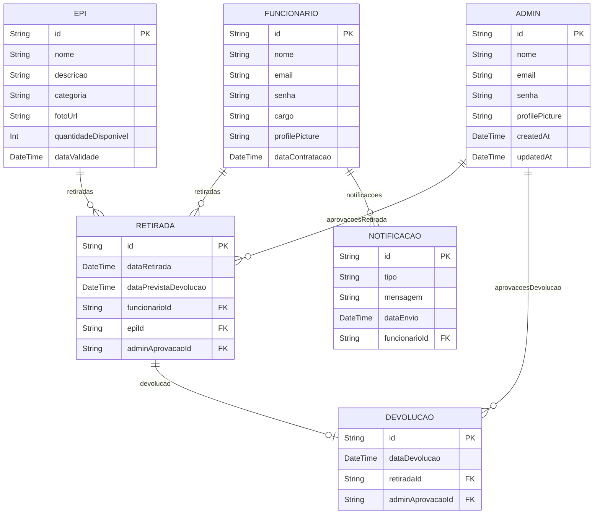

## Projeto PI

[Slide Presentation](https://www.canva.com/design/DAGIC_-R_X0/9Y1IY3wnL_3RCfglyLM-8Q/edit?utm_content=DAGIC_-R_X0&utm_campaign=designshare&utm_medium=link2&utm_source=sharebutton)

## UML Diagram

🧤🔒 Sistema de Controle de EPIs – Gestão Completa de Equipamentos de Proteção Individual

Sistema criado para empresas que precisam organizar, controlar e monitorar a entrega, validade, estoque e histórico de uso de Equipamentos de Proteção Individual (EPIs).

O foco é garantir rastreabilidade, segurança, automação e um fluxo real de almoxarifado, com rotas e permissões diferentes para colaboradores e gestores.

🚀 Tecnologias Utilizadas
Front-end

React

TypeScript

Vite

TailwindCSS

Zustand (ou Redux)

Axios

React Router DOM

Back-end

NestJS

Prisma ORM

PostgreSQL

JWT Authentication

Zod

Bcrypt

Docker (opcional)

👥 Perfis de Usuário
🔐 Almoxarife (Admin)

Gerencia o estoque completo

Controla entradas e saídas

Registra e acompanha retiradas

Define validade, lote, categoria e fornecedor

Acessa relatórios avançados

👷 Funcionário

Realiza login

Visualiza EPIs associados ao seu nome

Recebe notificações sobre validade próxima

Confirma retiradas

Tem histórico individual completo

📦 Principais Funcionalidades
🧤 Gestão de EPIs

Cadastro completo de itens (nome, categoria, lote, validade, fabricante)

Controle de estoque com atualização em tempo real

Notificações automáticos para EPIs vencidos ou prestes a vencer

👨‍🔧 Retirada e Devolução

Registro detalhado: colaborador, data, motivo e responsável

Histórico geral e histórico individual

Assinatura digital (opcional)

Lembretes automáticos para troca obrigatória

📊 Relatórios e Auditoria

EPIs por colaborador

EPIs vencidos

Histórico de movimentações

Relatórios para CIPA e auditorias internas

🔐 Segurança e Controle

Autenticação JWT

Níveis de permissão

Criptografia de senhas

Rastreabilidade completa de ações

📈 Diferenciais do Projeto

Arquitetura modular e escalável

Código limpo e fácil de manter

Fluxo real usado em empresas brasileiras

Sistema útil para segurança do trabalho

Solução real de mercado para seu portfólio

Demonstra maturidade técnica e conhecimento prático

🤝 Contribuições

Sugestões, ideias e melhorias são bem-vindas via Issues ou Pull Requests.

⭐ Curtiu o projeto? Deixe uma estrela!
